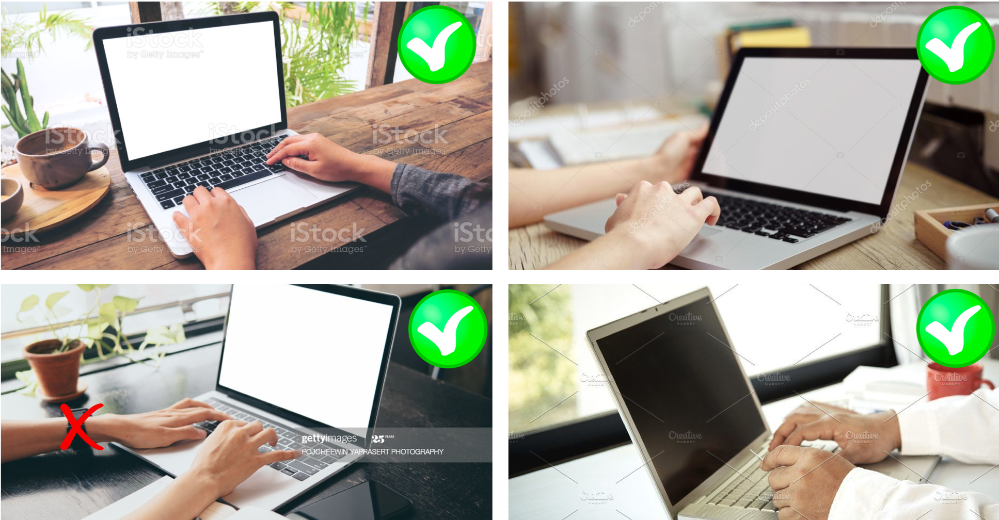
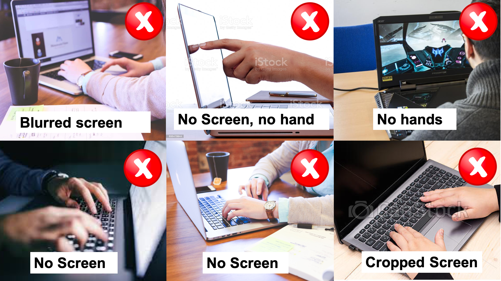

# Test Sample & Rules

##  [Sample Test Link](https://stepik.org/invitation/bfbdc45000af97f554b0cd75f146b9e6bcccfdef/)

## Topics

* Variables and their methods \(int, float, str, etc\)
* Data structures and their methods \(lists, tuples, dictionaries\)
* Loops \(for, while, list comprehension\)
* Declaration functions \(with def\)
* Basic functions \(round, len, set\)
* If-elif-else statements
* Math operations \(+, -, /, _, \*_, %, etc\)
* Importing libraries
* Importing external files \(txt, csv, json formats\)
* Regular expressions
* Reading input
* Printing output

## Rules

* Test lasts 60 minutes. 
* The student gets an integer grade for each task of a Test \(0 or 1 point\).
* Test consists of 10 tasks. 8 coding tasks \(submitting code with unlimited tries in Python 3 language; if Stepik system accepts your solution - you get 1 point, otherwise - 0 points\) and 2 multiple choice questions \(one attempt for each question; these questions will be automatically marked as correct but the final result will be checked manually\).
* Do not reproduce all testing cases manually in your coding tasks \(for example, using if statement and copy-pasting of correct output\). Such cases will be marked as zero points. Your solution should be general for any input.
* If the answer on the particular question in the Test is not full and/or incorrect \(the machine is not accepted you code task; the answer for multiple choice is not exact \[will be checked manually\]\), then the student gets 0 \(zero\) points for such a task/question.
* Tasks, that will be submitted after 60 minutes from Test starting time - will not be assessed.
* The cheating is strongly prohibited during the Test \(use of mobile devices, smart watches, headphones,  using of searching engines, help pages, chats, files with ready code, talking with the other students and looking at the other screen or paper, fabrication of results, fabrication of the personality, fabrication of video stream, any kind of plagiarism\).
* In case of cheating - the student gets 0 \(zero\) points for the whole Test and an official rebuke.
* If you start your recording after the official Test starting time \(publishing of Test tasks\) - the student gets 0 \(zero\) points for the whole Test.
* If your video stream will not be recorded and automatically placed in your private MS Teams chat - the student gets 0 \(zero\) points for the whole Test.
* If you disable sound in your recording or/and the strong monotonous echo exists - the student gets 0 \(zero\) points for the whole Test.
* The Test's video streams will be checked with asynchronous proctoring system. Thus, all official rules concerning proctoring check are also used \(find details in official HSE documents\). In addition, both hands should be in recording while you take the Test tasks \([sample hands position](test.md#sample-hands-and-screen-position) you can see below\).
* The test cannot be retaken \(official excuses should be sent and verified by study office and me not later then 24 hours before the Test starting time: all such cases will be discussed in individual manner\).
* In case of blackout \(any other technical problems with connection during the test\), that will stop your stream - automatically stops your test. Only such tasks will be assessed, that have been sent before this blackout.
* If you do not stop your recording properly \(later than 10 minutes after Test ends\) - the student gets the penalty of 25% from the final mark for the Test.

## Sample Hands and Screen Position

## Opportunity to Pass the Test Offline

* By default the test will be organized online.
* If HSE will not provide any COVID restrictions by the Test date, you can write the Test offline.
* In case of offline writing - you should send your name\_surname\_group from your @edu.hse.ru to my e-mail not later than 3 days before Test starting time.
* The rules for the offline version are the same, but you do not need to record your face and hands \(only screen recording will be required\). 10 minutes before the Test starts you need to sit on your place \(you can use your own laptop\) and show your student card or passport with your photo and name to the Lecturer. Start screen recording in MS Teams. Then, wait for official Test starting time.

## How to Start & Record Your Test

### Preparation

* Prepare your working space:
  * Provide the stable Internet connection during the whole test and charge all your devices;
  * No facilities except your working laptop/PC and the bottle of water on your table; 
  * Proper illumination \(ensure clear picture of your face in your recording\);
  * No people except of you;
  * No loud noise.
* Prepare one extra device \(e.g. mobile phone\) to shoot a video with your hands and your screen:
  * Ensure proper quality of your laptop's/PC's screen on your video \(without glares and blackouts\);
  * Turn off all your notifications and sound on your extra device;
  * Set it charged;
  * Put it in the following way: it should capture the whole screen of your laptop/PC and both your hands in the frame.
* Prepare your laptop/PC:
  * Open MS Teams \(web version\), Zoom, your Stepik account;
  * Open \(if you really need it\) one GUI with Python \(Spyder, Jupyter Notebook, PyCharm, etc\): it should be blank working file there only. You can only switch between Stepik account with Test and your GUI \(if you need it\) or split the screen into two parts \(one for Stepik account with Test, the other with your GUI\) or just only use Stepik system \(because number of tries for coding tasks is unlimited\).

### Start Recording

Your should start your recording before you will be given with the test tasks \(at least 5 minutes before official start of the Test\)! You can find [sample video recording](test.md#sample-video-recording) below.

* Use your MS Teams account and enter your personal private chat there \(it will be assigned to you\) from your extra mobile device \(which will record your screen and hands simultaneously\). Disable outcoming and incoming sound \(disable microphone and dynamics\). Press START RECORDING;
* Enter the same MS Teams account and the chat from your working laptop/PC. Allow video recording of your face. Allow the microphone sound. SHARE YOUR SCREEN \(the whole Desktop\);
* Open Zoom app on your computer and start your own conference. Allow video. Allow microphone sound. Start screen demonstration. Return to your browser with your Stepik account. You should be able to see the small frame with your face \(from Zoom app\) above of all your windows;
* Show your face \(put off your mask, if you wear it, for 20-30 seconds\) and your Student card \(Passport\) with your photo to both cameras \(ensure proper quality\).
* Say in the laptops'/PC's camera: "My name is NAME SURNAME. I know and accept the rules. I'm ready to start the test".
* After all steps above you should have at least one minute before the official test start.
* When it is time to start the test: refresh your page in Stepik account and start the test.
* When you finish the test. Please, say in the camera \(put off your mask, if you wear it, for 20-30 seconds\): "My name is NAME SURNAME. I've finished the test". Then, you should take your extra device and press STOP RECORDING.

## Sample Video Recording

Pay attention, that MS Teams cuts-off you extra device camera \(as seen in sample video\): try to move your phone a bit farther.



